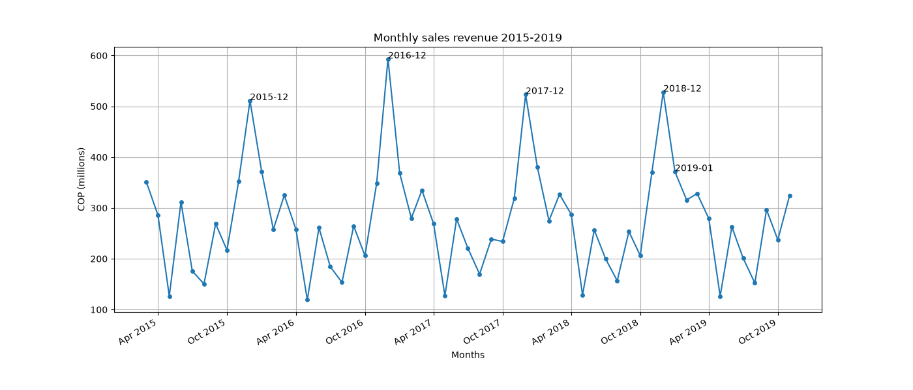
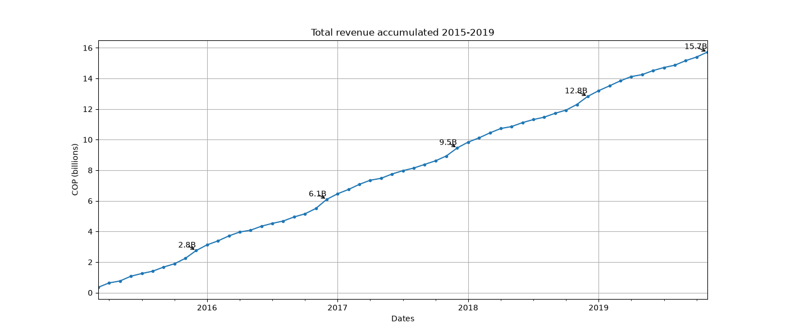

# pajamas_project — Inventory & Sales Analysis for a Family Retail Business

**Author:** Erik Acevedo · [github.com/Stahlkrieg](https://github.com/Stahlkrieg)

A reproducible inventory and sales analysis based on a small family retail business scenario: 250 SKUs,
five years of simulated sales and restocking movements, ABC classification, demand seasonality, and
restocking-cycle simulation built to turn raw movements into concrete replenishment
recommendations.

> **Honesty note:** the dataset is **synthetic but realistic**, generated with a fixed
> seed so every result is reproducible. It models a real family business's structure
> (catalog, pricing rules, seasonality, 80/20 demand) to demonstrate the analysis
> pipeline end to end.

---

## Why this project

The goal is to answer, with data, the questions a small retailer actually faces:

1. **What sells?** — demand trends and seasonality across 5 years.
2. **What matters?** — which SKUs drive revenue (ABC / Pareto).
3. **How do we replenish?** — stock levels over time and restocking cycles.
4. **How do we improve?** — a measured A/B test of the reorder policy.

---

## The data

Two tables, generated deterministically (`numpy` seeded RNG):

| Table | Rows | Contents |
|---|---|---|
| `products` | 250 | `SKU`, `Segment`, `Size`, `Unit Price`, `Initial Stock`, `Reorder Point` |
| `movements` | ~160k | `date` (2015–2019), `sku_id`, `type` (`Sell`/`Restock`), `quantity`, `unit_price` |

Demand embeds **seasonality** (December peak) and **SKU popularity** (a 80/20
distribution), so the ledger behaves like a real shop: a few fast movers, many slow ones.

---

## Analyses & findings

### 1 · Sales trends & seasonality
Monthly revenue and cumulative revenue over 5 years.

- Clear **December peak** and a mid-year trough.
- Cumulative curve shows steady growth with seasonal steps.
Total revenue accumulated over 5 years.

- Clear rise in sales along the years

### 2 · ABC / Pareto classification
SKUs ranked by revenue with the cumulative-share line.

- Revenue concentrates in a small A-class (~80/20), guiding differentiated control.

- Focused view on the top 30 SKUs.

### 3 · Stock levels & restocking cycles
Running stock per SKU vs. its reorder point; hit vs. tail comparison.

- **Fast movers** sawtooth tightly, refilling several times a month.
- **Slow movers** drain gently, restocking rarely.
- It's expect that under the current policy, A-items will show brief **stockouts at peak demand**.

### 4 · Improvement: reorder-policy A/B test *(Mission 6)*
Controlled experiment (identical demand seed; only the reorder rule changes):
raising the reorder point for A-items.

| Policy | Stockout events | Avg inventory | Restocks |
|---|---|---|---|
| A — current | baseline | baseline | baseline |
| B — raised reorder point | **−<X%>** | +<Y%> | + |

**Recommendation:** Increase the reorder point by 50% for A-class SKUs. 
This reduced stockouts by X% while increasing average inventory by Y%.

---

## Repository structure

```
pajamas_project/
├─ pajamas.py          # generators + analyses + plots (single entry point)
├─ pictures/                # exported charts referenced above
├─ data/               # (optional) exported CSVs of products/movements
└─ README.md
```

## Reproduce it

```bash
pip install numpy pandas matplotlib
python pajamas.py
```

All randomness uses a fixed seed, so outputs are identical on every run.

---

## Roadmap

- [x] Products catalog & movements ledger
- [x] Sales trends & seasonality
- [x] ABC / Pareto classification
- [x] Stock levels & restocking cycles
- [ ] Reorder-policy A/B test (Mission 6)
- [ ] **Layer 2 — SQL:** schema + window-function queries reproducing the analyses
- [ ] **Layer 3 — Power BI:** dashboard (DAX measures, slicers) on the same data

---

## Tools

Python · pandas · NumPy · Matplotlib — next: SQL, Power BI
